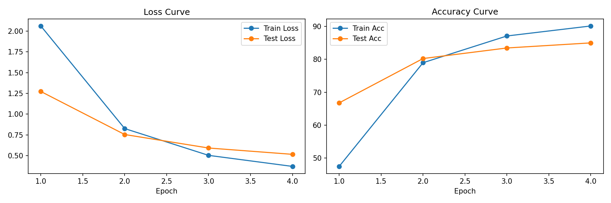
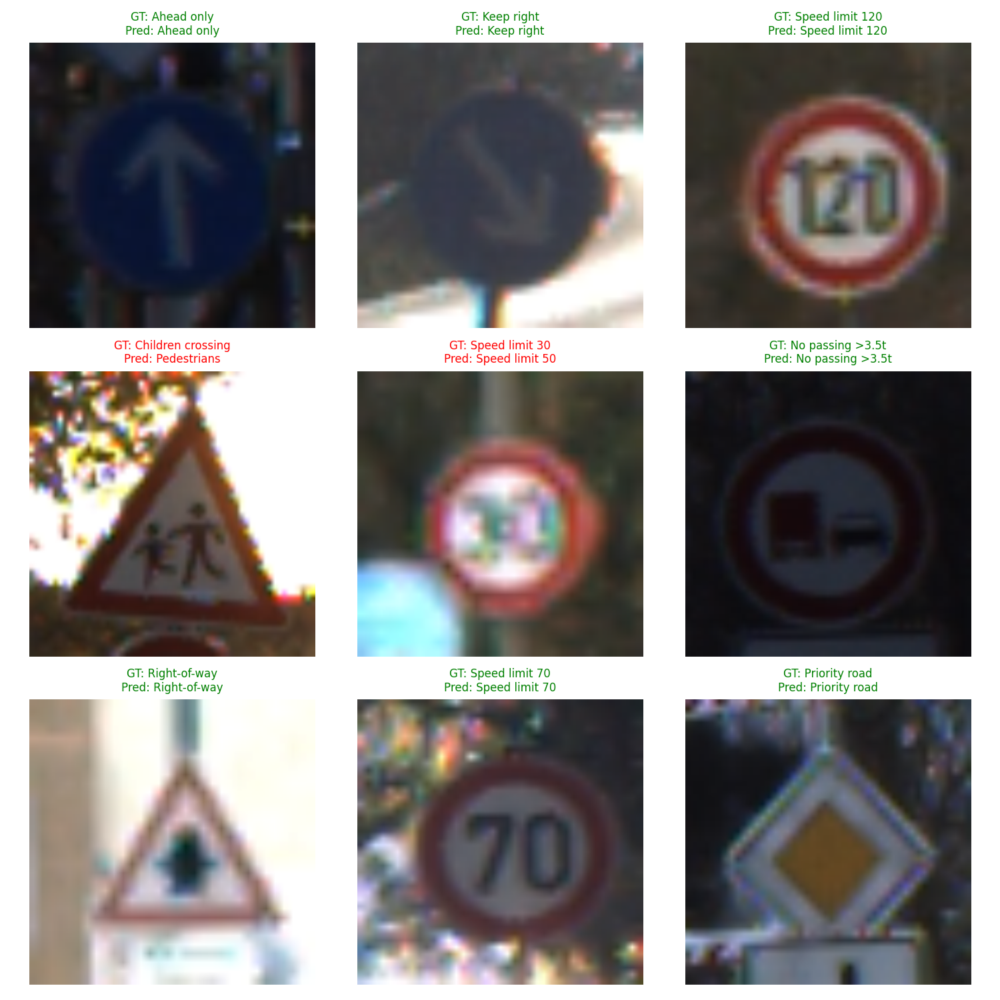
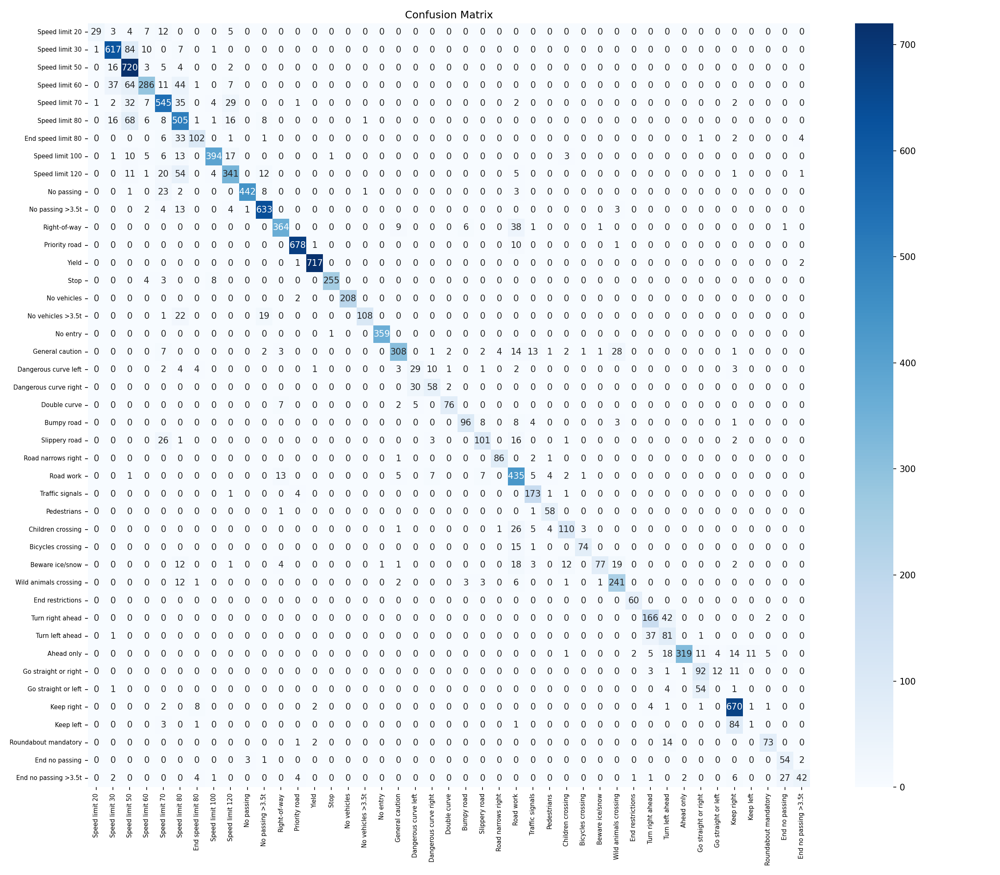

# 🚦 GTSRB Traffic Sign Classifier

A traffic sign classification web app built with a fine-tuned **Vision Transformer (ViT-B/16)** on the **German Traffic Sign Recognition Benchmark (GTSRB)** dataset.

🔗 **Live Demo:** [huggingface.co/spaces/ardapalas/gtsrb-traffic-sign-classifier](https://huggingface.co/spaces/ardapalas/gtsrb-traffic-sign-classifier)

---

## 📌 Project Overview

This project fine-tunes a pretrained ViT-B/16 model (ImageNet weights) on GTSRB to classify **43 different traffic sign categories**. The architecture was also implemented from scratch following the original ["An Image is Worth 16x16 Words"](https://arxiv.org/abs/2010.11929) paper to gain a deep understanding of the transformer architecture before applying transfer learning.

---

## 🏗️ Model Architecture

- **Base model:** ViT-B/16 pretrained on ImageNet
- **Fine-tuning strategy:** Last 4 encoder blocks + classification head unfrozen
- **Classification head:** `Dropout(0.3)` → `Linear(768 → 43)`
- **Input size:** 224×224 RGB

---

## 📊 Results

| Metric | Score |
|--------|-------|
| Train Accuracy | 90.15% |
| **Test Accuracy** | **85.01%** |
| Train Loss | 0.371 |
| Test Loss | 0.516 |

### Loss & Accuracy Curves


### Sample Predictions


### Confusion Matrix


---

## 🗂️ Dataset

- **Name:** [GTSRB - German Traffic Sign Recognition Benchmark](https://benchmark.ini.rub.de/)
- **Classes:** 43
- **Train samples:** ~39,000
- **Test samples:** ~12,000

---

## 🛠️ Tech Stack

- PyTorch & TorchVision
- Gradio (web interface)
- Google Colab (T4 GPU for training)

---

## 🚀 Run Locally

```bash
git clone https://github.com/ardapalas/GTSRB-ViT-Traffic-Sign-Classifier.git
cd GTSRB-ViT-Traffic-Sign-Classifier
pip install -r requirements.txt
python app.py
```

---

## 📁 Project Structure

\```
GTSRB-ViT-Traffic-Sign-Classifier/
├── app.py                       # Gradio web app
├── requirements.txt             
├── model/
│   └── gtsrb_vit_4epoch.pth    # Fine-tuned model weights (Git LFS)
├── assets/
│   ├── loss_accuracy_curves.png
│   ├── predictions.png
│   └── confusion_matrix.png
└── GTSRB_ViT.ipynb              # Training notebook
\```

---

## 📄 License

MIT
